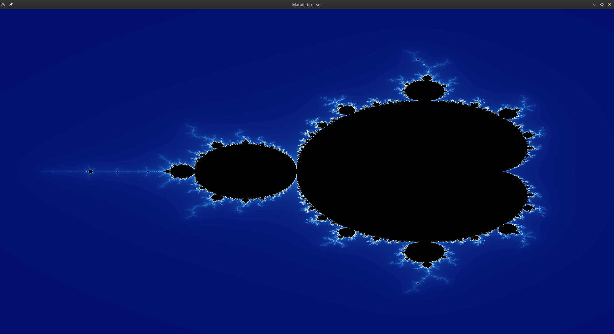
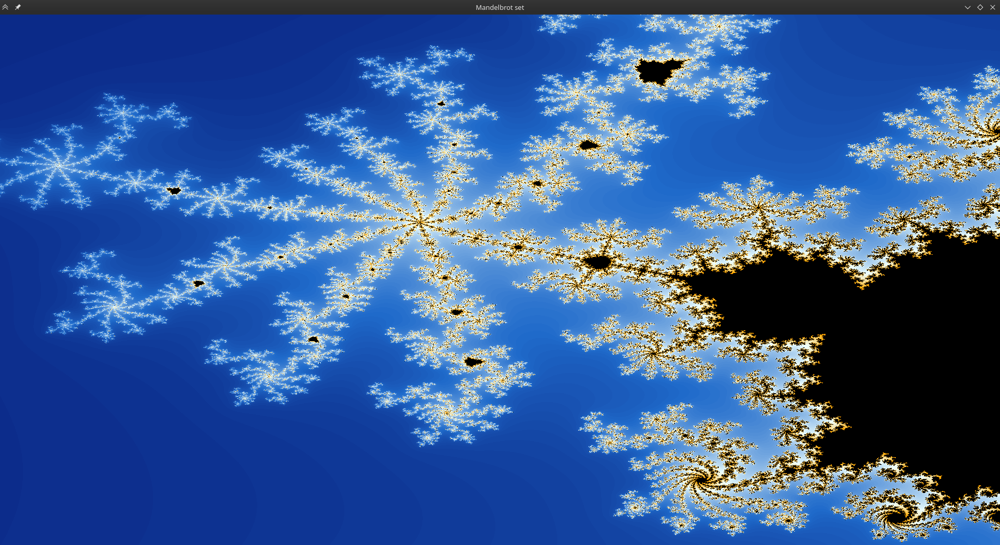
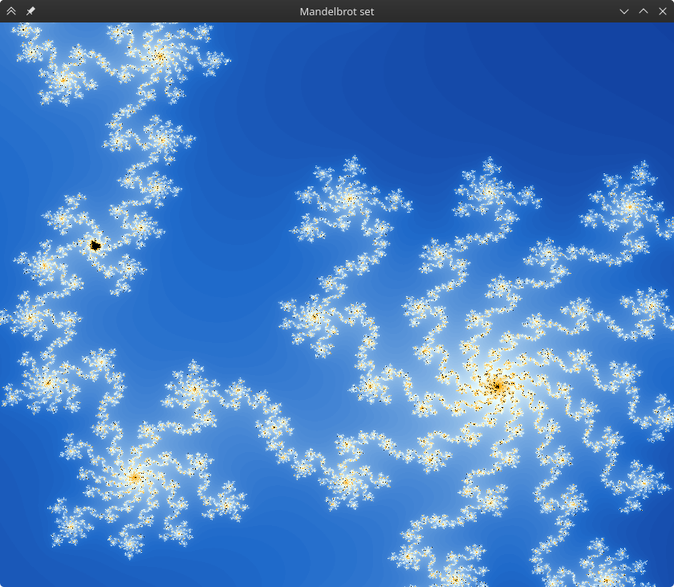
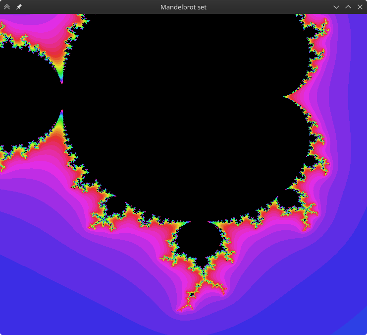
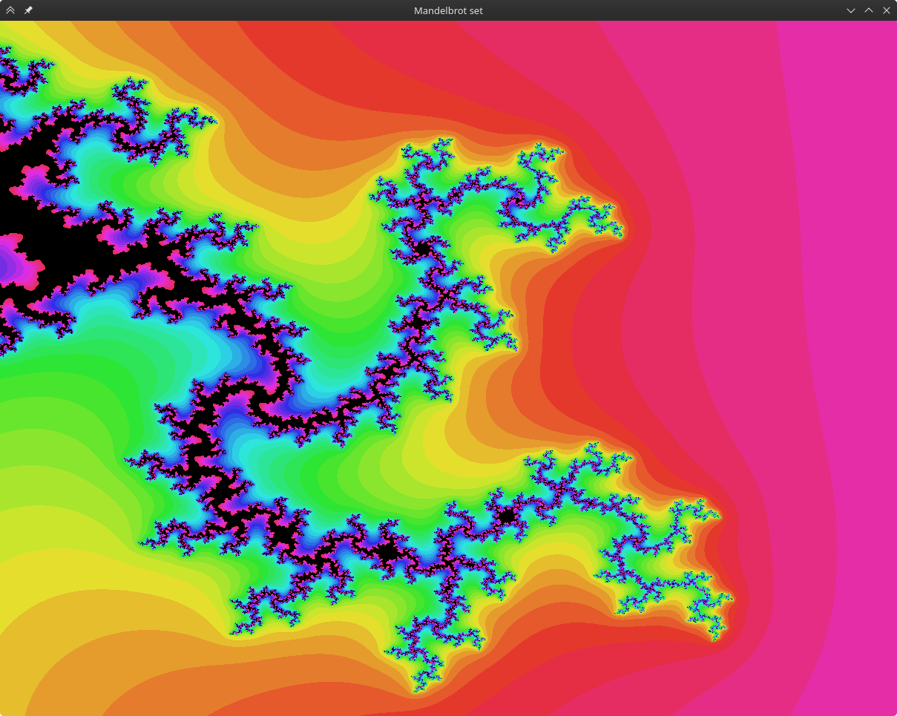

# mandelbrot.py

Mandelbrot set fractal simulation.

## Table of Contents

* [About](#about)
  * [Showcase](#showcase)
* [Code](#code)
  * [Constants](#constants)
  * [Functions](#functions)
  * [Main class](#main-class)
  * [Built with](#built-with)
* [Usage](#usage)
  * [Controls](#controls)
* [Dependencies](#dependencies)
* [References](#references)

## About

The Mandelbrot set is a set of complex numbers *c* for which *z<sub>n+1</sub> = z<sub>n</sub><sup>2</sup> + c* does not diverge to infinity (*z<sub>0</sub> = 0*).

Black colours denote points inside the set, while other colours are based on the number of iterations required to diverge.

### Showcase







## Code

### Constants

- `ROWS_PER_FRAME: int = 20` — Number of rows to display per frame.

### Functions

- `colour(n: float) -> tuple[int, int, int]:` — Returns an RGB tuple based on the value of n.
- `colour2(n: float) -> tuple[int, int, int]:` — Returns an RGB tuple based on the value of n, using a blue–orange–white colour palette.

### Main class

- `__init__`
  - `width: int | None = None` — Initial window dimensions; defaults to fullscreen if *None*.
  - `height: int | None = None` — Initial window dimensions; defaults to fullscreen if *None*.
  - `bound: int = 2` — Mandelbrot set boundary, usually *2*.
  - `max_iter: int = 50` — Number of iterations to check before assuming divergence.
  - `power: int = 2` — Exponent for the complex function, usually *2*.
  - `colour_func: Callable[[float], tuple[int, int, int]] = colour2` — Colouring function.
- `update_size(self) -> None:` — Updates window size and resets the buffer surface. Used on window resize.
- `mandelbrot(self) -> bool:` — Calculates the Mandelbrot set in chunks of `ROWS_PER_FRAME` rows for each pixel on the screen. The starting area is *[-2.2, 0.8]* by *[-1.5, 1.5]*.
- `draw_screen(self) -> None:` — Draws the previously calculated chunk of the Mandelbrot set from the buffer to the screen.
- `handle_keys(self, key: int | None=None) -> bool:` — Handles the pressed key or, if unspecified, all currently held keys. For inputs, see [Controls](#controls). Camera movement is done by shifting the covered area by a set fraction of the current screen size. Zooming in/out works by shrinking/stretching the camera's area.
- `run(self) -> None:` — Starts a Pygame window and runs the program's main loop which handles drawing and input events.

### Built with

- Python 3.14
- Pygame 2.6.1

## Usage

```python
from mandelbrot import App

app = App()
app.run()
```

### Controls

| Input                       | Action          |
|:----------------------------|:----------------|
| WASD / Arrow keys           | Move the camera |
| E / Page Up / Scroll Up     | Zoom in         |
| Q / Page Down / Scroll Down | Zoom out        |
| Escape                      | Quit            |

## Dependencies

- pygame

## References

- [Wikipedia — Mandelbrot set](https://en.wikipedia.org/wiki/Mandelbrot_set)
